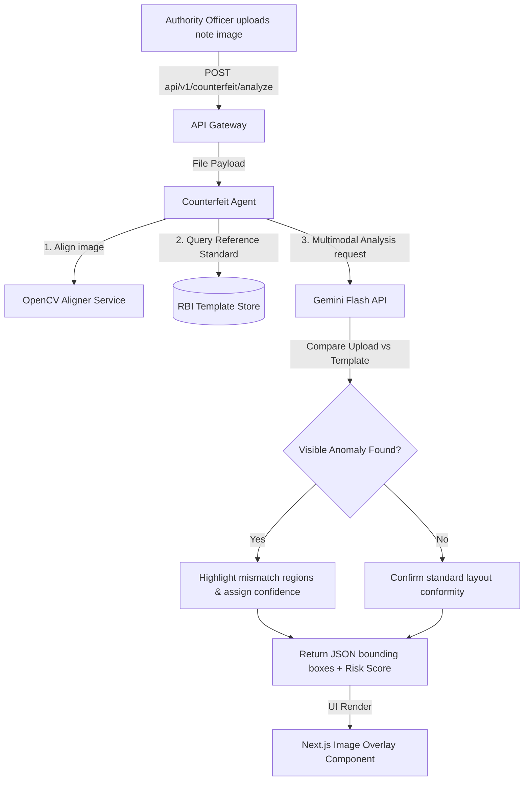

# Rakshak AI - Optimized Hackathon MVP Architecture

This document defines the system architecture, database schema, folder structures, API interfaces, and multi-agent orchestrations for **Rakshak AI** optimized for a 48-hour hackathon. The platform integrates a 7-agent setup to analyze threats, query relationship networks, scan counterfeit signs, and distribute regional security alerts.

---

## 🏛️ System Architecture

```mermaid
graph TD
    subgraph Client Layer (Govt-Style UI)
        A[Next.js 15 Web Portal] -->|HTTPS REST| B[FastAPI Gateway]
    end

    subgraph Service Layer (MVP Orchestration)
        B --> C[Public Safety Orchestrator]
    end

    subgraph Active MVP Agents (Gemini Flash API)
        C --> D[Threat Intelligence Agent]
        C --> E[Citizen Risk Agent]
        C --> F[Fraud Graph Agent]
        C --> G[Geospatial Intelligence Agent]
        C --> H[Counterfeit Detection Agent]
        C --> I[Alert and Notification Agent]
    end

    subgraph Future Scope Agent Assets
        C -.->|Future| J[Voice/Speech Deepfake Processor]
        C -.->|Future| K[Telecom Carrier Gateway API]
        C -.->|Future| L[UV/OVI Physical Note Scanner]
    end

    subgraph Data Layer
        B --> O[(PostgreSQL DB - Cases & Alerts)]
        F --> P[(Neo4j Graph - Mule Networks)]
    end
```

---

## 📂 Folder Structure

```
rakshak-ai/
├── backend/
│   ├── app/
│   │   ├── __init__.py
│   │   ├── main.py                    # FastAPI entrypoint
│   │   ├── core/
│   │   │   ├── config.py              # Environment settings
│   │   │   ├── security.py            # JWT and authentication
│   │   │   └── database.py            # DB engine connectors (SQL & Neo4j)
│   │   ├── models/
│   │   │   ├── postgres.py            # SQLAlchemy models
│   │   │   └── neo4j_nodes.py         # Graph node definitions
│   │   ├── api/
│   │   │   ├── v1/
│   │   │   │   ├── router.py          # Unified API router
│   │   │   │   ├── endpoints/
│   │   │   │   │   ├── citizen.py     # Reporting & alerts API
│   │   │   │   │   ├── authority.py   # Command center analytics
│   │   │   │   │   └── counterfeit.py # CV comparison endpoints [UPDATED]
│   │   ├── agents/
│   │   │   ├── orchestrator.py        # Public Safety Orchestrator
│   │   │   ├── threat_intel.py        # Threat Intelligence Agent
│   │   │   ├── citizen_risk.py        # Citizen Risk Agent
│   │   │   ├── fraud_graph.py         # Fraud Graph Agent
│   │   │   ├── counterfeit.py         # Counterfeit Detection Agent [REDESIGNED]
│   │   │   └── alert_notification.py  # Alert and Notification Agent
│   │   ├── resources/                 # Reference documents & images
│   │   │   └── templates/
│   │   │       ├── rbi_500_front.png  # RBI Reference Template for ₹500 [NEW]
│   │   │       └── rbi_500_back.png   # RBI Reference Template for ₹500 [NEW]
│   │   └── services/
│   │       ├── gemini.py              # Gemini API integrations (Multimodal note check)
│   │       ├── counterfeit_cv.py      # Basic OpenCV template alignment [NEW]
│   │       └── fraud_engine.py        # Rule-based transaction scores
│   ├── requirements.txt
│   └── Dockerfile
├── frontend/
│   ├── app/                           # Next.js App Router (TypeScript)
│   │   ├── layout.tsx                 # Global layout with govt header
│   │   ├── page.tsx                   # Citizen Portal Landing
│   │   ├── alerts/                    # National Alert Feed
│   │   │   └── page.tsx               # Alert Feed component & UI
│   │   ├── citizen/
│   │   │   ├── page.tsx               # Citizen Shield dashboard
│   │   │   ├── assistant/             # AI Safety Assistant (Chat)
│   │   │   └── report/                # Report a scam form
│   │   ├── authority/
│   │   │   ├── page.tsx               # Command Center dashboard
│   │   │   ├── graph/                 # Fraud network explorer view
│   │   │   ├── counterfeit/           # Currency verification view [UPDATED]
│   │   │   └── cases/                 # Investigation details
│   ├── components/                    # Reusable Tailwind components
│   │   ├── ui/                        # Buttons, inputs, tables (white/navy theme)
│   │   │   ├── Badge.tsx              # Risk status indicators (Low, Med, High, Critical)
│   │   │   ├── WarningBanner.tsx      # Navy/Orange hazard notification box
│   │   │   └── SearchFilters.tsx      # State and District lookup inputs
│   │   ├── MapContainer.tsx           # Leaflet/Geospatial component
│   │   ├── NetworkGraph.tsx           # Interactive Graph (D3.js)
│   │   └── ChatWidget.tsx             # Citizen Shield conversation component
│   ├── package.json
└── README.md
```

---

## 🛠️ Redesigned Counterfeit Detection Agent
### Responsibilities & Scope
The Counterfeit Agent is optimized for hackathon delivery by utilizing a **multimodal template-comparison workflow** (backed by Gemini Flash's image understanding) instead of custom CNN models or physical scanning rigs.

*   **MVP Scope (Feasible)**:
    *   Accepts user-uploaded photos of currency notes (e.g. ₹500).
    *   Uses basic OpenCV image alignment to crop and align the note to standard aspect ratios.
    *   Compares the aligned image side-by-side with official RBI reference templates stored at `/backend/app/resources/templates/`.
    *   Uses Gemini Flash (multimodal) to spot structural discrepancies: misspelled Hindi/English text, missing/altered national emblem motifs, serial number typeface mismatches, and severe alignment offsets of security elements.
    *   Returns coordinates of flagged suspicious bounding box regions and a confidence percentage.
*   **Future Scope (Post-MVP)**:
    *   Ultraviolet (UV) watermark signature verification under varying spectrum values.
    *   Optical Variable Ink (OVI) metallic sheen change validations using video files.
    *   High-magnification microscopic texture profiling to catch offset counterfeits.

---

## 🔄 Counterfeit Verification Data Flow



---

## 🔌 API Design

### 1. Authority Portal Endpoints

#### **Submit Counterfeit Specimen for Template-Matching Analysis**
*   **Endpoint**: `POST /api/v1/authority/counterfeit/analyze`
*   **Request (Multipart Form-Data)**:
    *   `file`: Specimen image (JPG/PNG)
    *   `denomination`: `500`
*   **Response (200 OK)**:
```json
{
  "is_counterfeit": true,
  "confidence_score": 0.88,
  "serial_number_read": "9AA 402941",
  "discrepancies": [
    {
      "feature": "National Emblem Seal",
      "issue_type": "ALIGNMENT_ERROR",
      "description": "Emblem motif is shifted 4mm to the left relative to standard RBI template parameters.",
      "bounding_box": {
        "x_min": 120,
        "y_min": 45,
        "x_max": 210,
        "y_max": 130
      }
    },
    {
      "feature": "Language Panel Spelling",
      "issue_type": "TYPOGRAPHIC_ERROR",
      "description": "Spelling inconsistency detected in regional script text panel.",
      "bounding_box": {
        "x_min": 50,
        "y_min": 180,
        "x_max": 110,
        "y_max": 240
      }
    }
  ]
}
```

---

## 🤖 Agent Communication Design

*(Maintained from previous specification, with the Counterfeit Detection Agent now running visual difference evaluations and passing bounding box layouts back to the orchestrator).*

---

## 🖼️ Page Wireframe: `/alerts` (National Alert Feed)

*(Maintained from previous specification).*
